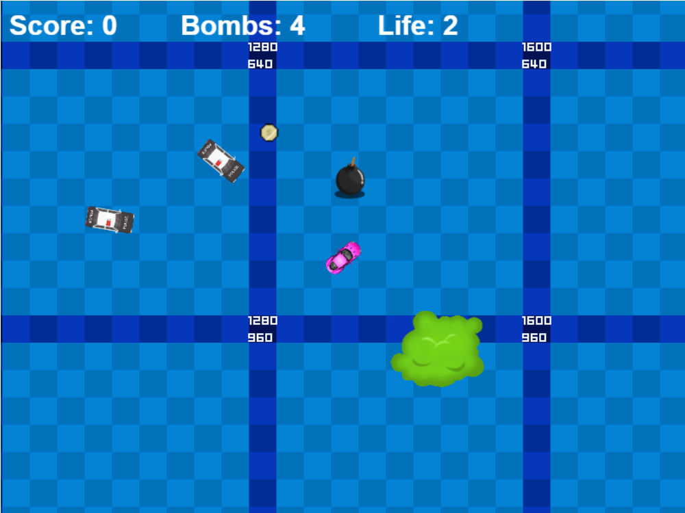

# Run Away Game

  

This is a simple arcade game in which the player must avoid police cars.

## Technologies
* JavaScript
* Phaser Framework

## Features
* Scrolling world
* Interactions such as shooting and placing bombs
* Collecting coins and hearts
* Animated objects

## Screenshot

## Live preview
* Go to https://m-uszynski.github.io/runaway/(https://m-uszynski.github.io/runaway/)
